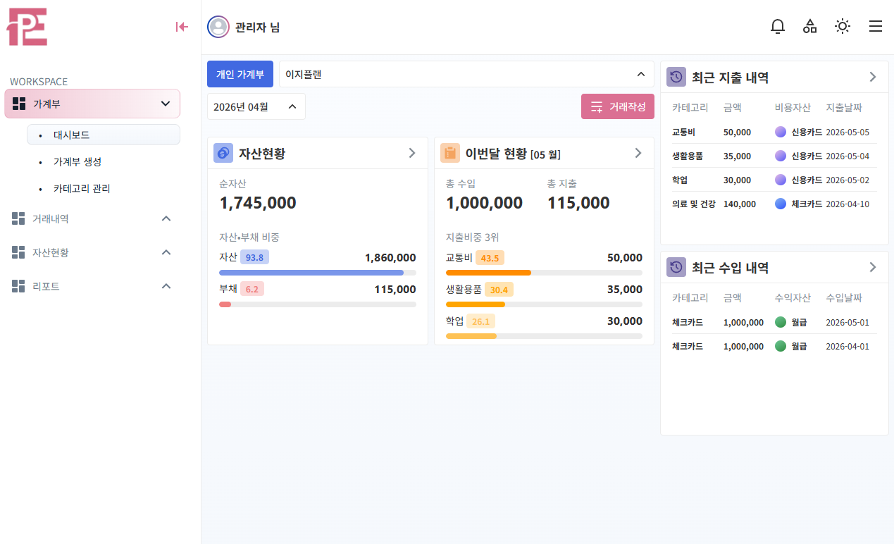
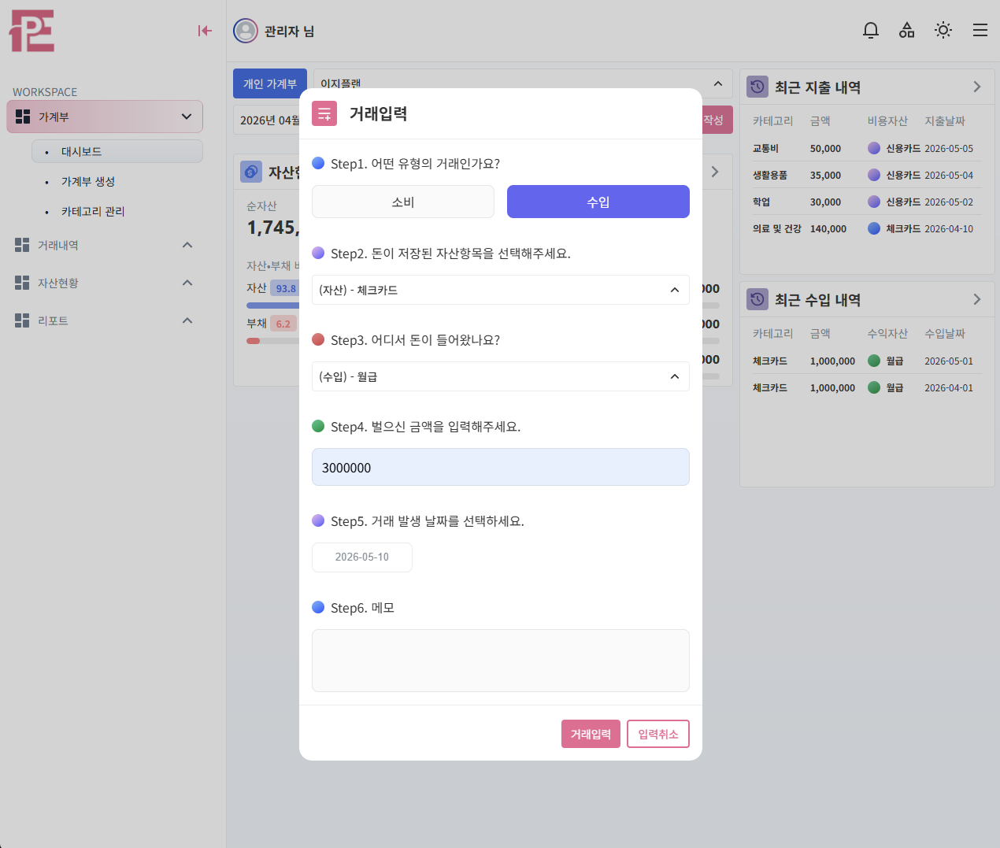
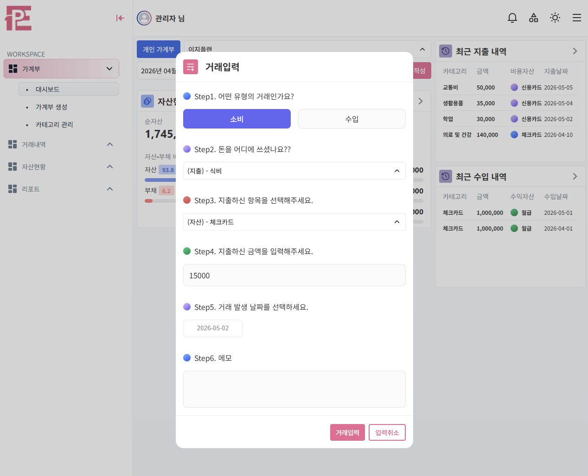
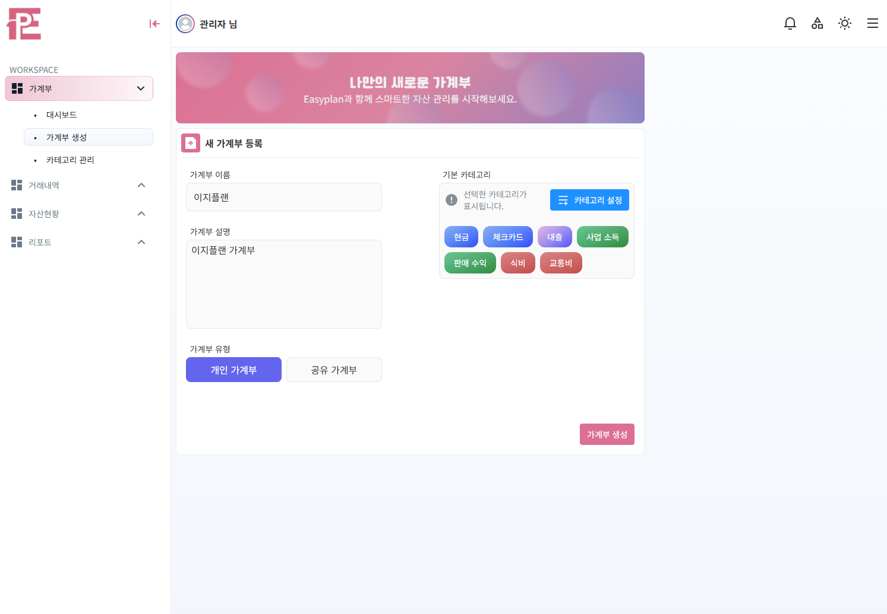
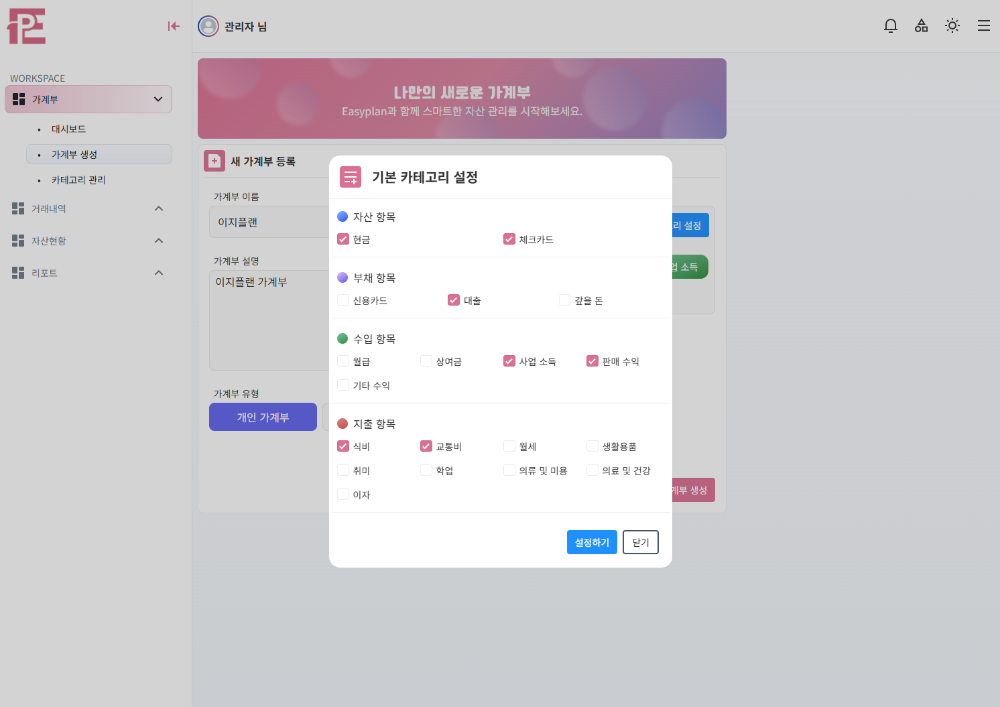
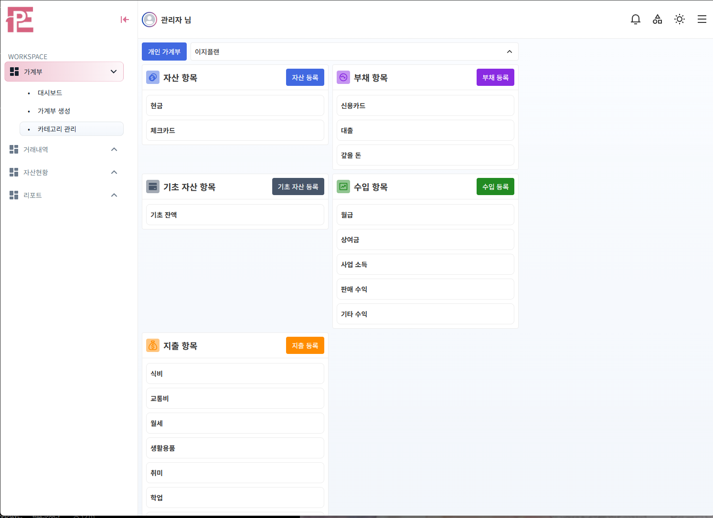
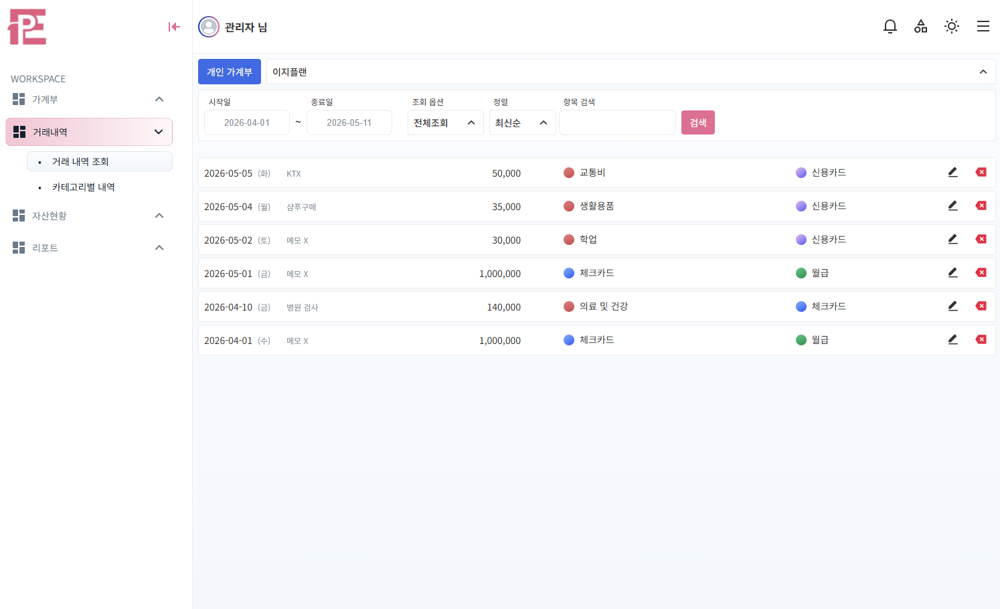
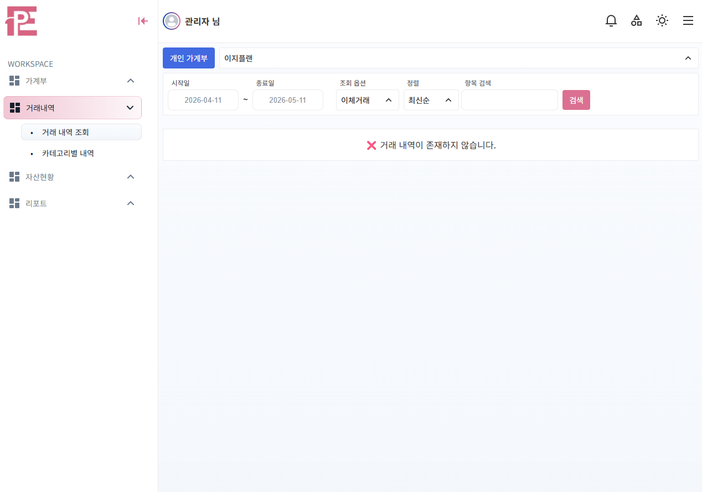

## 프로젝트 소개
✔️ Easyplan - 복식부기 기반 가계부 서비스

✔️ JWT 기반 인증/인가

✔️ QueryDSL과 인덱스 튜닝, 쿼리 튜닝을 통한 조회 성능 개선

## 개발 기간
- 2026년 03월 25일 ~ 2026년 04월 25일
- Easyplan v2.0 2026년 04월 30일 ~ 개발중

## 기술 스택
<strong>Backend</strong>
- Spring Boot
- Spring Data JPA
- Spring Security
- QueryDSL
- Redis

<strong>Frontend</strong>
- JavaScript / CSS / HTML

## 핵심기능
✔️ 복식부기식 회계 처리
- 단순 수입/지출 기록이 아니라, 하나의 거래를 차변과 대변으로 분리하여 저장하는 구조로 설계했습니다.

✔️ 거래 내역 조회
- 가계부 대시보드에서는 현재 가계부의 자산 상태를 집계하여 보여줍니다. 이 집계 쿼리를 QueryDSL로 작성했고, 로컬 서버를 기준으로 검색될 테이블에 50만 row의 테스트 데이터를 생성해서 EXPLAIN 을 찍어가면서 인덱스 튜닝, 쿼리 튜닝으로 조회 성능을 네트워크 응답 기준 1,500ms -> 220ms 로 개선했었습니다.

# 📃 프로젝트 회고
✔️ <strong>기술적 경험</strong>

1️⃣ JWT 인증 구현
- `세션 기반 인증 대신 JWT를 사용한 이유.`
  - 서버 확장 시에 세션 의존도를 줄이고 싶었고, RESTful API 기반 구조에 적합한 인증 방식을 경험해보고 싶었습니다.

- `RefreshToken을 JWT대신 랜덤 문자열로 구현`
  - RefreshToken을 JWT가 아닌 랜덤 문자열로 생성했었는데 RefreshToken은 단순 재발급 용도이기 때문에 크기가 큰 JWT 형식일 필요가 있을까? 라는 생각에 중복되지 않은 랜덤 문자열로 구성했습니다.
  - ex) iHoXRWrAz7iIoVOvqbiJwzJ4F2DNOfcbpoWCal2xYpEbHaZxUUokBTjEKCCM1Okj
  - 또한 DB 유출시 RefreshToken 노출 위험을 줄이기 위해서 해시값(SHA-256)만 저장하는 구조로 설계했습니다.

2️⃣ QueryDSL 기반 조회 구현
- `QueryDSL의 사용 이유`
  - JPA를 사용할 때는 MyBatis처럼 직접적으로 SQL을 만드는 것이 아니었고, 메서드 이름 기반으로 만들어진다고 할 지라도 조건이 많아질수록 유지보수가 어려워진다고 판단해서 QueryDSL을 사용했습니다. 특히 여러 필터기반으로 거래 내역을 조회했을 때 하나의 엔드포인트로 그것을 구현하기 위해서 동적으로 다양한 조건을 조합해야했기 때문에 QueryDSL이 적합하다고 판단했습니다.

  - 또한 MyBatis나 JPQL등 문자열 형태로 쿼리문을 작성하는 것은 컴파일 시에 오류를 발견하는 것이 불가능하지만 QueryDSL은 컴파일 시에 잘못 작성된 쿼리를 미리 발견하여 불필요한 시간 낭비를 줄일 수 있는 점도 좋았습니다.

  - 조회 성능을 개선하는 과정에서 Application Side Join 방식에 대해 알게되었고 이를 적용해보았습니다. 먼저 조회 대상 Key를 선별한 뒤, 해당 데이터만 별도로 조회하는 방식으로 불필요한 Join 범위를 줄임으로써 단순히 쿼리만 수정하는 것이 답이 아니라 조회 전략 자체를 바꾸는 것도 성능 개선의 전략이 될 수 있다는 점을 경험했습니다.

3️⃣ 복합 인덱스 설계 및 성능 분석
- `MySQL EXPLAIN`
  - 대시보드 집계 쿼리를 만들고 과연 이 테이블에 수십만개의 데이터가 들어가 있어도 빠를까? 라는 생각에 테스트 데이터 50만개를 만들어서 넣었었습니다. 그 결과 서비스가 불가능한 속도를 경험했었는데, 이 조회 기능을 개선하기 위해서 EXPLAIN 실행 계획을 찍어보고 인덱스를 설계해서 filesort가 일어나는지 검사하면서 개선했었습니다.

  - 단순히 이렇게 짜면 빠르겠지? 라는 것보다 이런 EXPLAIN 기능을 이용했을 때 판단의 기준이 잡히는 것이 가장 큰 장점이었습니다.

4️⃣ 병렬 조회 방식
- `CompletableFuture를 사용한 병렬 조회`
  - 대시보드 조회 성능을 개선하는 과정에서 각 조회 쿼리가 서로 독립적인 읽기 작업이라는 점이 눈에 보였는데 이 경우 병렬로 처리하면 성능이 더 개선될 것이라 생각해서 적용했습니다.

# 📃 아쉬웠던 점
- <strong>테스트 코드의 부재</strong>
  - 빠르게 기능을 구현하는 것에 집중하다보니 테스트 코드를 작성하지 않고 다음 기능으로 넘어갔었습니다. 그래서 구현되어 있던 기존 기능을 수정했을 때 제대로 동작하는지에 대한 검증과정이 좀 오래걸렸었습니다.

- <strong>도메인 엔티티 모델과 JPA 엔티티 모델의 분리</strong>
  - 처음 프로그래밍을 시작했을 때 제 실력이 빠르게 늘었던 지점이 디자인 패턴을 배울 때 였습니다. 아마 이때 OOP에 관해서 조금은 더 이해할 수 있게 된 시기가 아니었나 싶은데, 도메인 주도 개발에 관해서 알아보면서 이 프로젝트를 도메인 주도 개발 방법론을 적용해서 해보고자 시도했었습니다. 그 과정에서 도메인 엔티티 모델과 JPA 엔티티 모델을 분리하는 방향을 고집했었는데 이렇게 해보니 사실 단점이 더 컸던 것 같습니다.

  - 도메인이 늘어나면서 조회 및 저장 과정마다 Domain <-> Entity 변환 및 매핑 로직이 반복적으로 필요했고, 프로젝트의 규모에 비해서 코드가 많이 복잡하다고 느꼈었습니다. 특히 (객체 생성), (Domain <-> Entity 변환) 등 비슷한 객체를 2배로 작성하는 단점이 많이 컸었습니다.

  - 도메인 주도 개발에서 순수한 도메인 객체만으로 테스트가 가능하다고 해야하는데 그 도메인 객체에 JPA 의존성이 있더라도 사실 테스트에는 아무 문제가 없음을 개선하고 있는 버전을 진행하면서 알게 되었습니다.

  ---
  ## 화면
  ✅ 대시보드
  

  ✅ 거래 입력 (수입 거래)
  

  ✅ 거래 입력 (소비 거래)
  

  ✅ 가계부 생성
  

  ✅ 가계부 생성 시 카테고리 설정
  

  ✅ 카테고리 (계정항목) 관리
  

  ✅ 거래 내역 조회
  

  ✅ 거래 내역 없음
  